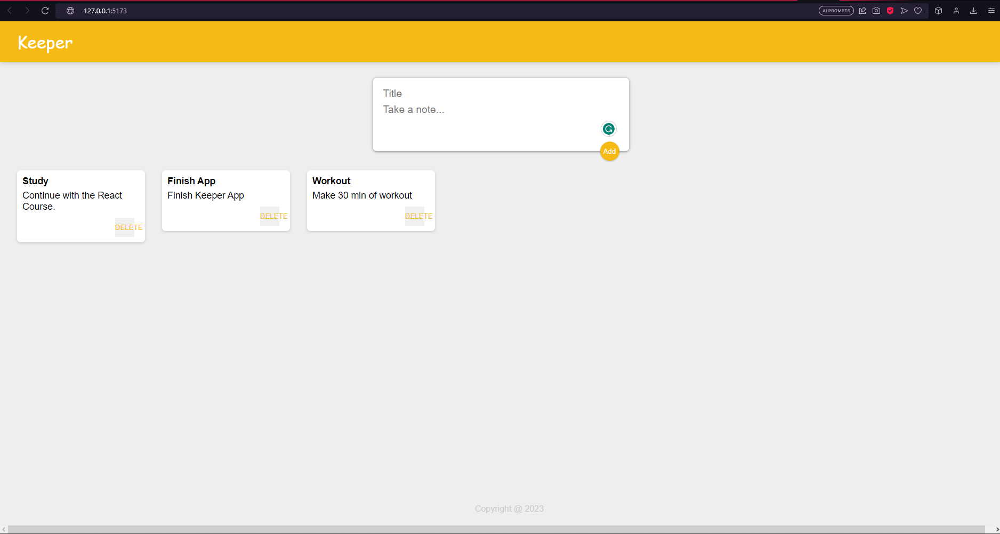

# Keeper App with React

- This is a version inpired by Goog Keep app.

Users should be able to:

- Create a new card with title and content
- Add this new card to his/hers list of cards
- Delete the used cards 

### Screenshot

### Built with

- Semantic HTML5 markup
- CSS custom properties
- Flexbox
- CSS Grid
- Mobile-first workflow
- [React](https://react.dev)

### What I learned

This is my first React App. I learned how to use it´s components and how to pass data from one component to another.

